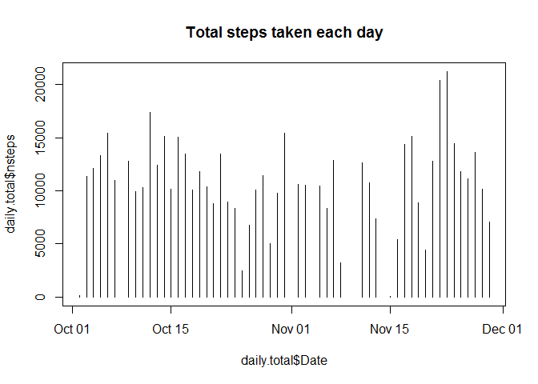
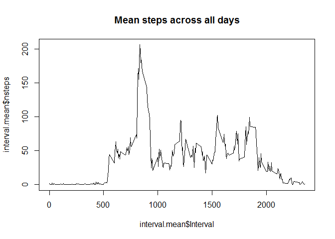
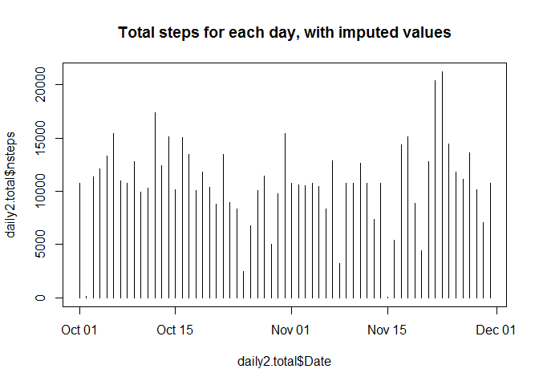
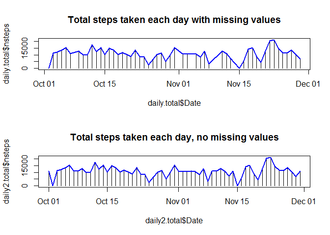
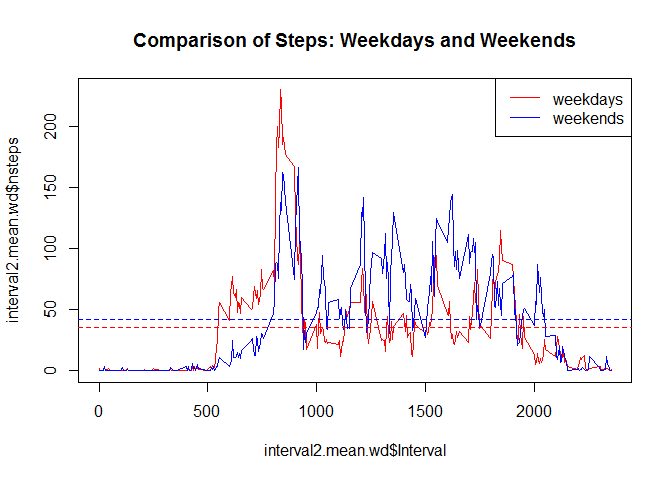

# Reproducible Research: Peer Assessment 1
John Southgate  
12th January 2017  


# Investigate data from a personal activity monitoring device

## Setup

```r
library(dplyr)
```

```
## Warning: package 'dplyr' was built under R version 3.3.2
```

```
## 
## Attaching package: 'dplyr'
```

```
## The following objects are masked from 'package:stats':
## 
##     filter, lag
```

```
## The following objects are masked from 'package:base':
## 
##     intersect, setdiff, setequal, union
```


## Loading and preprocessing the data

```r
activity <- read.csv("activity.csv", colClasses = "character")
str(activity)
```

```
## 'data.frame':	17568 obs. of  3 variables:
##  $ steps   : chr  NA NA NA NA ...
##  $ date    : chr  "2012-10-01" "2012-10-01" "2012-10-01" "2012-10-01" ...
##  $ interval: chr  "0" "5" "10" "15" ...
```

```r
head(activity)
```

```
##   steps       date interval
## 1  <NA> 2012-10-01        0
## 2  <NA> 2012-10-01        5
## 3  <NA> 2012-10-01       10
## 4  <NA> 2012-10-01       15
## 5  <NA> 2012-10-01       20
## 6  <NA> 2012-10-01       25
```

```r
summary(activity$steps)
```

```
##    Length     Class      Mode 
##     17568 character character
```

```r
table(activity$steps)
```

```
## 
##     0     1    10   100   101   102   103   104   105   106   107   108 
## 11014     7    46     8    12     7    10     8     9     9     8     7 
##   109    11   110   111   112   113   114   115   116   117   118   119 
##     8    43     7    11    10     6    10     6     5    10     4    13 
##    12   120   121   122   123   124   125   126   127   128   129    13 
##    43     8     6     7     7     8     1     3     6    10     7    42 
##   130   131   132   133   134   135   136   137   138   139    14   140 
##     3     6     2     3     2    10     6     9     7     7    30     2 
##   141   142   143   144   145   146   147   148   149    15   150   151 
##     3     6    10     5     3     9     1     7     6    68     2     2 
##   152   153   154   155   156   157   158   159    16   160   161   162 
##     6     8     8     2     6     4     5     6    65     4     5     1 
##   163   164   165   166   167   168    17   170   171   172   173   174 
##     5     3     2     4     4     8    61     8     6     7     6     7 
##   175   176   177   178   179    18   180   181   182   183   184   185 
##     3     6     1     4     6    50     4     3     3     3     3     3 
##   186   187   188   189    19   190   191   192   193   194   195   196 
##     4     2     4     3    51     7     1     2     5     3     1     1 
##   197   198   199     2    20   200   201   202   203   204   205   206 
##     5     4     3     8    53     2     3     2     6     3     3     1 
##   207   208   209    21   210   211   212   213   214   216   219    22 
##     3     2     1    38     1     3     1     1     1     2     2    46 
##   221   223   224   225   229    23   230   231   232   235   236   237 
##     2     4     1     2     1    40     2     2     3     1     1     2 
##   238    24   240   241   242   243   244   245   247   248   249    25 
##     2    42     1     2     2     3     1     3     3     1     1    40 
##   250   251   252   253   254   255   256   257   258   259    26   260 
##     2     1     2     1     1     1     1     3     1     1    34     7 
##   261   262   263   264   265   266   267   269    27   270   271   272 
##     1     2     2     3     1     4     2     2    45     1     1     3 
##   274   275   276   277   279    28   280   281   282   283   284   285 
##     2     3     2     4     3    42     2     5     2     2     2     3 
##   286   287   289    29   290   291   292   293   294   295   297   298 
##     5     1     1    36     2     2     2     2     2     1     1     5 
##   299     3    30   301   302   303   304   305   306   307   308   309 
##     1     3    37     2     1     1     1     1     3     1     2     1 
##    31   310   311   312   313   314   315   316   317   318   319    32 
##    41     4     3     2     1     2     1     2     2     1     4    44 
##   320   321   322   323   324   325   326   327   328    33   330   331 
##     1     3     2     2     2     2     2     1     2    48     2     1 
##   332   333   334   335   336   339    34   340   341   343   344   345 
##     3     1     4     3     1     1    35     2     1     2     1     3 
##   346   347   349    35   350   351   353   354   355   356   357   358 
##     1     1     4    46     1     4     1     1     1     2     1     3 
##   359    36   360   361   362   363   364   365   366   368    37   370 
##     1    37     1     2     2     1     4     1     3     1    33     1 
##   371   372   373   374   375   376   377   378    38   380   384   385 
##     3     1     1     2     1     1     4     1    45     2     1     1 
##   387   388   389    39   391   392   393   394   395   396   397   399 
##     2     1     3    44     2     2     5     1     3     2     2     2 
##     4    40   400   401   402   403   404   405   406   408    41   410 
##    25    39     4     2     2     3     3     1     2     2    24     1 
##   411   412   413   414   415   416   417   418   419    42   421   422 
##     4     2     5     2     3     3     1     3     1    31     1     1 
##   423   424   425   426   427   428   429    43   431   432   433   434 
##     1     1     3     1     1     1     2    37     1     4     3     1 
##   435   436   437   439    44   440   441   442   443   444   446   449 
##     2     1     2     4    31     4     2     1     4     4     4     1 
##    45   450   451   453   454   456   457   458   459    46   461   462 
##    22     2     3     3     2     1     2     1     1    38     1     2 
##   463   464   465   466   467   468   469    47   470   471   472   473 
##     4     1     4     2     1     5     2    24     1     1     2     4 
##   474   475   476   477   478   479    48   480   481   482   483   484 
##     1     4     4     1     1     2    24     1     1     3     4     1 
##   485   486   487   488   489    49   490   491   492   493   494   495 
##     4     2     2     3     6    30     1     2     1     2     3     4 
##   496   497   498   499     5    50   500   501   503   504   505   506 
##     3     2     2     4    17    29     3     3     2     6     3     3 
##   507   508   509    51   510   511   512   513   514   515   516   517 
##     4     4     3    27     2     6     3     4     1     4     2     3 
##   518   519    52   520   521   522   523   524   526   527   528   529 
##     2     6    32     2     1     5     4     2     5     4     3     5 
##    53   530   531   532   533   534   535   536   537   539    54   540 
##    23     2     1     3     8     3     1     2     1     1    18     5 
##   541   542   544   545   546   547   548   549    55   551   553   555 
##     2     2     2     1     4     1     1     2    33     1     1     2 
##   556   559    56   562   567   568   569    57   571   573   574   577 
##     1     1    25     1     1     2     1    28     1     1     1     1 
##    58   581   584    59   591   592   594   597     6    60   600   602 
##    28     1     1    24     1     1     1     1    33    30     1     1 
##   606   608    61   611   612   613   614   618   619    62   625   628 
##     1     1    21     1     1     3     1     1     2    31     1     1 
##    63   630   634   635   637   638   639    64   643    65   652   655 
##    24     1     1     1     1     1     1    27     1    22     3     1 
##   659    66   662   665   667   668    67   679    68   680   681   682 
##     2    22     1     1     1     1    17     1    24     2     1     1 
##   686   687    69   690   693   697   698     7    70   701   706   708 
##     1     1    18     1     1     1     1    87    20     1     2     1 
##   709    71   710   713   714   715   717   718    72   720   721   725 
##     1    26     1     2     1     2     1     1    16     1     4     1 
##   726   727   729    73   730   731   732   733   734   735   736   737 
##     2     1     1    13     1     3     2     4     1     2     1     2 
##   738   739    74   741   742   743   744   745   746   747   748   749 
##     1     2    25     1     3     3     2     1     2     4     4     2 
##    75   750   751   752   753   754   755   756   757   758   759    76 
##    18     3     1     1     2     2     3     2     4     5     2    18 
##   760   765   766   767   768   769    77   770   777    78   781   783 
##     2     1     1     1     1     1    15     3     1    18     1     1 
##   785   786   789    79   794     8    80   802   806    81    82    83 
##     3     1     1    18     1    83    19     1     1    13    17    10 
##    84    85    86    87    88    89     9    90    91    92    93    94 
##    10    14    14     6    14     9    61    12     7    14     6    12 
##    95    96    97    98    99 
##    13     7    10     8     9
```

```r
### NB: 11014 inactive intervals - no steps
```

## Pre-process the table for the correct formats

```r
activity$nsteps<-as.numeric(activity$steps)
activity$Date<-as.Date(activity$date)
activity$Interval<-as.numeric(activity$interval)
```

## What is mean total number of steps taken per day?
### Calculate the total number of steps taken per day
Ignoring days with no data

```r
daily.total<-aggregate(nsteps ~ Date, sum, data=activity,na.rm=TRUE)
head(daily.total)
```

```
##         Date nsteps
## 1 2012-10-02    126
## 2 2012-10-03  11352
## 3 2012-10-04  12116
## 4 2012-10-05  13294
## 5 2012-10-06  15420
## 6 2012-10-07  11015
```
check

```r
daily.steps<-split(activity$nsteps, activity$Date)
head(daily.steps)
```

```
## $`2012-10-01`
##   [1] NA NA NA NA NA NA NA NA NA NA NA NA NA NA NA NA NA NA NA NA NA NA NA
##  [24] NA NA NA NA NA NA NA NA NA NA NA NA NA NA NA NA NA NA NA NA NA NA NA
##  [47] NA NA NA NA NA NA NA NA NA NA NA NA NA NA NA NA NA NA NA NA NA NA NA
##  [70] NA NA NA NA NA NA NA NA NA NA NA NA NA NA NA NA NA NA NA NA NA NA NA
##  [93] NA NA NA NA NA NA NA NA NA NA NA NA NA NA NA NA NA NA NA NA NA NA NA
## [116] NA NA NA NA NA NA NA NA NA NA NA NA NA NA NA NA NA NA NA NA NA NA NA
## [139] NA NA NA NA NA NA NA NA NA NA NA NA NA NA NA NA NA NA NA NA NA NA NA
## [162] NA NA NA NA NA NA NA NA NA NA NA NA NA NA NA NA NA NA NA NA NA NA NA
## [185] NA NA NA NA NA NA NA NA NA NA NA NA NA NA NA NA NA NA NA NA NA NA NA
## [208] NA NA NA NA NA NA NA NA NA NA NA NA NA NA NA NA NA NA NA NA NA NA NA
## [231] NA NA NA NA NA NA NA NA NA NA NA NA NA NA NA NA NA NA NA NA NA NA NA
## [254] NA NA NA NA NA NA NA NA NA NA NA NA NA NA NA NA NA NA NA NA NA NA NA
## [277] NA NA NA NA NA NA NA NA NA NA NA NA
## 
## $`2012-10-02`
##   [1]   0   0   0   0   0   0   0   0   0   0   0   0   0   0   0   0   0
##  [18]   0   0   0   0   0   0   0   0   0   0   0   0   0   0   0   0   0
##  [35]   0   0   0   0   0   0   0   0   0   0   0   0   0   0   0   0   0
##  [52]   0   0   0   0   0   0   0   0   0   0   0   0   0   0   0   0   0
##  [69]   0   0   0   0   0   0   0   0   0   0   0   0   0   0   0   0   0
##  [86]   0   0   0   0   0   0   0   0   0   0   0   0   0   0   0   0   0
## [103]   0   0   0   0   0   0   0   0   0   0   0   0   0   0   0   0   0
## [120]   0   0   0   0   0   0   0   0   0   0   0   0   0   0   0   0   0
## [137]   0   0   0   0   0   0   0   0   0   0   0   0   0   0   0   0   0
## [154]   0   0   0   0   0   0   0   0   0   0   0   0   0   0   0   0   0
## [171]   0   0   0   0   0   0   0   0   0   0   0   0   0   0   0   0   0
## [188]   0   0   0   0   0   0   0   0   0   0   0   0   0   0   0   0   0
## [205]   0   0   0   0   0   0   0   0   0   0   0   0   0   0   0   0   0
## [222]   0   0   0   0   0   0   0   0   0   0   0   0   0   0   0   0   0
## [239]   0   0   0   0   0   0   0   0   0   0   0   0   0   0   0   0   0
## [256]   0   0   0   0   0   0   0   0   0   0   0 117   9   0   0   0   0
## [273]   0   0   0   0   0   0   0   0   0   0   0   0   0   0   0   0
## 
## $`2012-10-03`
##   [1]   0   0   0   0   0   0   0   0   0   0   0   0   0   0   0   0   0
##  [18]   0   0   0   0   0   0   0   0   0   0   0   0   0   0   0   0   0
##  [35]   0   0   0   0   0   0   0   0   0   0   0   0   0   0   0   0   4
##  [52]   0   0   0  36   0   0   0   0   0   0   0   0   0   0   0   0  25
##  [69]   0   0  90 411 413 415 519 529 613 562 612 534 323 600 533 251  56
##  [86]   0  32  80  10   9 145  46   0  44 126  42 138  53   0   0  22  57
## [103] 161  19  15   0  16   0   0   8   0  51 516 245   0 161   7   0   0
## [120]   0   0   0   0   0   0   0   0   0   0   0   0   0   0   0   0   0
## [137]   0   0   0  72  73   0   0 116  97   0   0   0   0   0  15   0   0
## [154]   0   0   0  80  69   0   0   0   0   0   0   0  99 100   0   0  33
## [171]   0   0   7   0   0   0   0   0   0   0   0   0   0   0   0   0   0
## [188]   0   0  88 154   0  20   0   0   0   0   0   0   0   0   0   0   0
## [205]   0   0 198  61  75   0   0 193 298   0  15  21   0   0   0   0  51
## [222]  36   0  26  22   0  39  52  15  41   0  42   0   0 159  32   0   0
## [239]   0   0  34   0   0   0   0  36  73   9   0   0   0   0   0   0   0
## [256]   0   0   0  90 128  46   0   0   0   0   0   0   0   0   0   0   0
## [273]   0   0   0   0   0   0   0   0   0   0   0   0   0   8   0   0
## 
## $`2012-10-04`
##   [1]  47   0   0   0   0   0   0   0   0   0   0   0   0   0   0   0   0
##  [18]   0   0   0   0   0   0   0   0   0   0   0   0   0   0   0   0   0
##  [35]   0   0   0   0   0   0   0   0   0   0   0   0   0   0   0   0   0
##  [52]   0   0   0   0   0   0   0   0   0   0   0   7  18  57  40   0   0
##  [69]   0   0  16   1   0  18  20  40  36  17  49  86  49   0  29  59   7
##  [86]  25  30  31   7  18 113 181  87   0   0   0  57  99 507 522 510 519
## [103] 508 423 499 259  31  17   0   0   0   0   0  17   0 145 453 229 144
## [120]   0   0   0  82   0   0   0   0   0   0   0   0   0   0   0   0   0
## [137]   0 180  21   0   0   0   0   0 160  79   0   0   0  46  66 127   0
## [154]   0   0   0   0   0  31   0   0   0   0   0  28 496  78   0   0   0
## [171]   0   0   0   0   0  77  20   7   1 128 354 310   0   0  25  15   0
## [188]   0   0   0  33  33  32  66  77   0  44   0   0   0   0   0   0   0
## [205]   0   0   0   0   0  40   0  37  90  53  73  92 285 527 531 547 175
## [222] 114  62   0  59  65   0 101  43   0   0   0  49  21   0  16  56   0
## [239]   0   0   0   0   0   0   0   0   0   0  17  15   0   0  27 106 122
## [256]  41  35   6   0   0  68   0   0   0   0   0   0   0   0   0   0   0
## [273]   0   0   0   0   0   0   0   0   0   0   0   0   0   0   0   0
## 
## $`2012-10-05`
##   [1]   0   0   0   0   0   0   0   0   0   0   0   0   0   0   0   0   0
##  [18]   0   0   0   0   9  14   0   0   0   0   0   0   7   0   0   0   0
##  [35]  27   0   0   0   0   0   0   0   0   0   0   0   0   0   0  39   0
##  [52]   0   0   0   0   0   0   0   0   0   0  27   0   0   0   0   0   0
##  [69]   0   0   0  52  36   0   0  28  67 119   7  21  29  68  29   0  11
##  [86]  19  84  50   2  43 126  30  19   8 171  68 114   0   9 122 400 451
## [103] 371 470 473 512 449 496 530 509 252  84  16   0   6  46  39   0   0
## [120]   0   0   0   0   0   0   0   0   0   0   0   0   0   0   0   0   0
## [137]   0   0   0   0   0   0   0   0 138 541 555 345 345  10 485 515 168
## [154]   0   0   0   0   0   0   0 349 341   0   0   0   0   0 158 545  82
## [171]   0 105   0   0   0   0   0   0   0   0   0   0   0   0   0   0   0
## [188]   0 326 172 332 402  70   0   0   0   0   0   0   0   0   0   0   0
## [205]   0   0   0  53   0   0   0   0   0   0   7  10  65  40  15  29   0
## [222]  20  35  69  25  46  15  26  33  58  75  59   0   0   0   0   0   0
## [239]   0   0   0   0   0   0   0   0   0  71   0   0   0   0   0   0   0
## [256]   0   0   0   0   0   0   0   0   0   0   0   0   0   0   0   0   0
## [273]   0   0   0   0   0   0   0   0   0   0   0   0   0   0   0   0
## 
## $`2012-10-06`
##   [1]   0   0   0   0   0   0   0   0   0   0   0   0   0   0   0   0   0
##  [18]   0   0   0   0   0   0   0   0   0   0   0   0   0   0   0   0   0
##  [35]   0   0   0   0   0   0   0   0  40  11   0   0   0   0   0   0   0
##  [52]   0   0  19  67   0   0   0   0   0   0   0   0   0   0   0   0   0
##  [69]  27   0   0   0   0   0   0  36  50  38   0   4  42  14   8 135 172
##  [86] 124  31  52   0 104 170  58   0   0  75   0   0 211 321 149   0  82
## [103]  94 225 216 199  50 187  30   0  65 173  43   0   0   0   0   0   0
## [120]   0  16  26   0   0   0   0   0   0   0   0   0   0   0   0   0   0
## [137]   0   0   0  95  64   7  33  72 221 439 519 440 394  97  71  10  87
## [154] 443 500 465 485 351 515 511 506 486 171  12  24  42 140  15   0  43
## [171]  67  48   0   0   9  31  30  64 115  25   0  27   0   0   0   0   0
## [188]   0   0   0   0   0  27  27   0   0   9   0   0  54  35   0  49   0
## [205]   0   0   0  93   0   0  13   0   6  12   0   0  34  77 173 370 402
## [222] 504 485 437 526 264   0  35 124  93   0   0   0   0   0   0   0   0
## [239]   0   0   0   0  33 118   0   6   0 262  33  46  35   0   0   0   0
## [256]   0   0   0   0   0   0   0   0   0   0   0   0   0   0   0   0   0
## [273]   0   0   0   0   0   0   0   0   0   0   0   0   0   0   0   0
```

### Make a histogram of the total number of steps taken each day
include inactive intervals

```r
plot(daily.total$Date,daily.total$nsteps,type="h", main="Total steps taken each day")
```

<!-- -->

## Calculate and report the mean and median of the steps taken per day
mean: include inactive intervals

```r
daily.mean<-aggregate(nsteps ~ Date, mean, data=activity,na.rm=TRUE)
head(daily.mean)
```

```
##         Date   nsteps
## 1 2012-10-02  0.43750
## 2 2012-10-03 39.41667
## 3 2012-10-04 42.06944
## 4 2012-10-05 46.15972
## 5 2012-10-06 53.54167
## 6 2012-10-07 38.24653
```

median: include inactive intervals

```r
daily.median<-aggregate(nsteps ~ Date, median, data=activity,na.rm=TRUE)
head(daily.median)
```

```
##         Date nsteps
## 1 2012-10-02      0
## 2 2012-10-03      0
## 3 2012-10-04      0
## 4 2012-10-05      0
## 5 2012-10-06      0
## 6 2012-10-07      0
```

## What is the average daily activity pattern?
### Calculate average number of steps taken, averaged across all days (y-axis)

```r
interval.mean<-aggregate(nsteps ~ Interval, mean, data=activity,na.rm=TRUE)
head(interval.mean)
```

```
##   Interval    nsteps
## 1        0 1.7169811
## 2        5 0.3396226
## 3       10 0.1320755
## 4       15 0.1509434
## 5       20 0.0754717
## 6       25 2.0943396
```

```r
plot(interval.mean$Interval,interval.mean$nsteps,type="l", main="Mean steps across all days")
```

<!-- -->

## Which 5-minute interval, on average across all the days in the dataset, contains the maximum number of steps?
Now use the dplyr objects (tibble) and functions 

```r
df<-tbl_df(activity)
#class(df)
Intervals<-group_by(df, Interval)
#Intervals %>% print(n = nrow(.))
Intervals.max.steps <- summarize(Intervals, max.steps = max(nsteps, na.rm=T))
#Intervals.max.steps %>% print(n = nrow(.))
Interval.max<-arrange(Intervals.max.steps, desc(max.steps))[1,]$Interval
#Interval.max
print (paste("Maximum steps occurs in the",Interval.max,"minute interval"))
```

```
## [1] "Maximum steps occurs in the 615 minute interval"
```

## Imputing missing values

### Calculate and report the total number of missing values in the dataset (i.e. the total number of rows with NAs)

```r
activity.cases<-complete.cases(activity) 
ac<-activity[activity.cases,]
print(paste((nrow(activity)-nrow(ac)),"missing rows"))
```

```
## [1] "2304 missing rows"
```

### Devise a strategy for filling in all of the missing values in the dataset. 
Just take the mean of steps for interval across all days and apply it to each interval with missing values 

```r
Intervals.mean.steps <- round(summarize(Intervals, mean.steps = mean(nsteps, na.rm=T)))
#Intervals.mean.steps %>% print(n = nrow(.))
#nrow(Intervals.mean.steps)
```

### Create a new dataset that is equal to the original dataset but with the missing data filled in

```r
activity2<-activity

for (i in 1:nrow(activity)) 
{
	if (is.na(activity$nsteps[i])) 
	{activity2$nsteps[i] <- Intervals.mean.steps[(Intervals.mean.steps$Interval==activity$Interval[i]),]$mean.steps
	}
	else
	{activity2$nsteps[i] <- activity$nsteps[i]
	}
	activity2$steps[i] <- as.character(activity2$nsteps[i])
	}
head(activity2,20)
```

```
##    steps       date interval nsteps       Date Interval
## 1      2 2012-10-01        0      2 2012-10-01        0
## 2      0 2012-10-01        5      0 2012-10-01        5
## 3      0 2012-10-01       10      0 2012-10-01       10
## 4      0 2012-10-01       15      0 2012-10-01       15
## 5      0 2012-10-01       20      0 2012-10-01       20
## 6      2 2012-10-01       25      2 2012-10-01       25
## 7      1 2012-10-01       30      1 2012-10-01       30
## 8      1 2012-10-01       35      1 2012-10-01       35
## 9      0 2012-10-01       40      0 2012-10-01       40
## 10     1 2012-10-01       45      1 2012-10-01       45
## 11     0 2012-10-01       50      0 2012-10-01       50
## 12     0 2012-10-01       55      0 2012-10-01       55
## 13     0 2012-10-01      100      0 2012-10-01      100
## 14     1 2012-10-01      105      1 2012-10-01      105
## 15     0 2012-10-01      110      0 2012-10-01      110
## 16     0 2012-10-01      115      0 2012-10-01      115
## 17     0 2012-10-01      120      0 2012-10-01      120
## 18     1 2012-10-01      125      1 2012-10-01      125
## 19     2 2012-10-01      130      2 2012-10-01      130
## 20     0 2012-10-01      135      0 2012-10-01      135
```

```r
head(Intervals.mean.steps,20)
```

```
## # A tibble: 20 × 2
##    Interval mean.steps
##       <dbl>      <dbl>
## 1         0          2
## 2         5          0
## 3        10          0
## 4        15          0
## 5        20          0
## 6        25          2
## 7        30          1
## 8        35          1
## 9        40          0
## 10       45          1
## 11       50          0
## 12       55          0
## 13      100          0
## 14      105          1
## 15      110          0
## 16      115          0
## 17      120          0
## 18      125          1
## 19      130          2
## 20      135          0
```

### Calculate the total number of steps taken per day

```r
daily2.total<-aggregate(nsteps ~ Date, sum, data=activity2,na.rm=TRUE)
head(daily2.total)
```

```
##         Date nsteps
## 1 2012-10-01  10762
## 2 2012-10-02    126
## 3 2012-10-03  11352
## 4 2012-10-04  12116
## 5 2012-10-05  13294
## 6 2012-10-06  15420
```
check

```r
daily2.steps<-split(activity2$nsteps, activity2$Date)
head(daily2.steps)
```

```
## $`2012-10-01`
##   [1]   2   0   0   0   0   2   1   1   0   1   0   0   0   1   0   0   0
##  [18]   1   2   0   0   0   0   0   0   0   1   0   0   0   0   0   0   0
##  [35]   2   1   0   0   0   0   0   1   2   1   0   0   0   0   1   1   3
##  [52]   0   0   0   4   1   3   1   3   1   0   2   3   2   3   3   2   6
##  [69]  16  18  39  44  31  49  54  63  50  47  52  39  44  44  37  49  44
##  [86]  44  51  55  50  51  56  44  52  70  58  56  73  68 129 158 171 155
## [103] 177 206 196 180 183 167 143 124 109 108 104  96  66  45  25  39  35
## [120]  21  41  27  42  53  39  51  44  37  35  28  25  32  31  30  21  26
## [137]  28  26  33  50  42  45  46  59  64  88  95  93  63  50  54  32  27
## [154]  38  45  67  42  40  43  41  46  56  43  25  40  54  47  61  56  52
## [171]  44  49  35  38  42  28  17  26  44  44  30  36  35  39  46  48  48
## [188]  65  83  99 102  84  62  64  75  63  57  60  44  39  45  45  46  44
## [205]  47  56  51  61  73  79  69  60  75  57  35  37  41  58  75  85  59
## [222]  68  78  74  85  99  87  86  85  78  58  53  36  21  27  40  30  26
## [239]  46  34  20  19  19  33  27  21  27  21  20  21  32  20  16  17  23
## [256]  19  12   8  15  16   9   8   8   3   1   4   5   9   7   9  10   2
## [273]   0   0   2   5   3   3   0   1   1   2   3   5   3   1   0   1
## 
## $`2012-10-02`
##   [1]   0   0   0   0   0   0   0   0   0   0   0   0   0   0   0   0   0
##  [18]   0   0   0   0   0   0   0   0   0   0   0   0   0   0   0   0   0
##  [35]   0   0   0   0   0   0   0   0   0   0   0   0   0   0   0   0   0
##  [52]   0   0   0   0   0   0   0   0   0   0   0   0   0   0   0   0   0
##  [69]   0   0   0   0   0   0   0   0   0   0   0   0   0   0   0   0   0
##  [86]   0   0   0   0   0   0   0   0   0   0   0   0   0   0   0   0   0
## [103]   0   0   0   0   0   0   0   0   0   0   0   0   0   0   0   0   0
## [120]   0   0   0   0   0   0   0   0   0   0   0   0   0   0   0   0   0
## [137]   0   0   0   0   0   0   0   0   0   0   0   0   0   0   0   0   0
## [154]   0   0   0   0   0   0   0   0   0   0   0   0   0   0   0   0   0
## [171]   0   0   0   0   0   0   0   0   0   0   0   0   0   0   0   0   0
## [188]   0   0   0   0   0   0   0   0   0   0   0   0   0   0   0   0   0
## [205]   0   0   0   0   0   0   0   0   0   0   0   0   0   0   0   0   0
## [222]   0   0   0   0   0   0   0   0   0   0   0   0   0   0   0   0   0
## [239]   0   0   0   0   0   0   0   0   0   0   0   0   0   0   0   0   0
## [256]   0   0   0   0   0   0   0   0   0   0   0 117   9   0   0   0   0
## [273]   0   0   0   0   0   0   0   0   0   0   0   0   0   0   0   0
## 
## $`2012-10-03`
##   [1]   0   0   0   0   0   0   0   0   0   0   0   0   0   0   0   0   0
##  [18]   0   0   0   0   0   0   0   0   0   0   0   0   0   0   0   0   0
##  [35]   0   0   0   0   0   0   0   0   0   0   0   0   0   0   0   0   4
##  [52]   0   0   0  36   0   0   0   0   0   0   0   0   0   0   0   0  25
##  [69]   0   0  90 411 413 415 519 529 613 562 612 534 323 600 533 251  56
##  [86]   0  32  80  10   9 145  46   0  44 126  42 138  53   0   0  22  57
## [103] 161  19  15   0  16   0   0   8   0  51 516 245   0 161   7   0   0
## [120]   0   0   0   0   0   0   0   0   0   0   0   0   0   0   0   0   0
## [137]   0   0   0  72  73   0   0 116  97   0   0   0   0   0  15   0   0
## [154]   0   0   0  80  69   0   0   0   0   0   0   0  99 100   0   0  33
## [171]   0   0   7   0   0   0   0   0   0   0   0   0   0   0   0   0   0
## [188]   0   0  88 154   0  20   0   0   0   0   0   0   0   0   0   0   0
## [205]   0   0 198  61  75   0   0 193 298   0  15  21   0   0   0   0  51
## [222]  36   0  26  22   0  39  52  15  41   0  42   0   0 159  32   0   0
## [239]   0   0  34   0   0   0   0  36  73   9   0   0   0   0   0   0   0
## [256]   0   0   0  90 128  46   0   0   0   0   0   0   0   0   0   0   0
## [273]   0   0   0   0   0   0   0   0   0   0   0   0   0   8   0   0
## 
## $`2012-10-04`
##   [1]  47   0   0   0   0   0   0   0   0   0   0   0   0   0   0   0   0
##  [18]   0   0   0   0   0   0   0   0   0   0   0   0   0   0   0   0   0
##  [35]   0   0   0   0   0   0   0   0   0   0   0   0   0   0   0   0   0
##  [52]   0   0   0   0   0   0   0   0   0   0   0   7  18  57  40   0   0
##  [69]   0   0  16   1   0  18  20  40  36  17  49  86  49   0  29  59   7
##  [86]  25  30  31   7  18 113 181  87   0   0   0  57  99 507 522 510 519
## [103] 508 423 499 259  31  17   0   0   0   0   0  17   0 145 453 229 144
## [120]   0   0   0  82   0   0   0   0   0   0   0   0   0   0   0   0   0
## [137]   0 180  21   0   0   0   0   0 160  79   0   0   0  46  66 127   0
## [154]   0   0   0   0   0  31   0   0   0   0   0  28 496  78   0   0   0
## [171]   0   0   0   0   0  77  20   7   1 128 354 310   0   0  25  15   0
## [188]   0   0   0  33  33  32  66  77   0  44   0   0   0   0   0   0   0
## [205]   0   0   0   0   0  40   0  37  90  53  73  92 285 527 531 547 175
## [222] 114  62   0  59  65   0 101  43   0   0   0  49  21   0  16  56   0
## [239]   0   0   0   0   0   0   0   0   0   0  17  15   0   0  27 106 122
## [256]  41  35   6   0   0  68   0   0   0   0   0   0   0   0   0   0   0
## [273]   0   0   0   0   0   0   0   0   0   0   0   0   0   0   0   0
## 
## $`2012-10-05`
##   [1]   0   0   0   0   0   0   0   0   0   0   0   0   0   0   0   0   0
##  [18]   0   0   0   0   9  14   0   0   0   0   0   0   7   0   0   0   0
##  [35]  27   0   0   0   0   0   0   0   0   0   0   0   0   0   0  39   0
##  [52]   0   0   0   0   0   0   0   0   0   0  27   0   0   0   0   0   0
##  [69]   0   0   0  52  36   0   0  28  67 119   7  21  29  68  29   0  11
##  [86]  19  84  50   2  43 126  30  19   8 171  68 114   0   9 122 400 451
## [103] 371 470 473 512 449 496 530 509 252  84  16   0   6  46  39   0   0
## [120]   0   0   0   0   0   0   0   0   0   0   0   0   0   0   0   0   0
## [137]   0   0   0   0   0   0   0   0 138 541 555 345 345  10 485 515 168
## [154]   0   0   0   0   0   0   0 349 341   0   0   0   0   0 158 545  82
## [171]   0 105   0   0   0   0   0   0   0   0   0   0   0   0   0   0   0
## [188]   0 326 172 332 402  70   0   0   0   0   0   0   0   0   0   0   0
## [205]   0   0   0  53   0   0   0   0   0   0   7  10  65  40  15  29   0
## [222]  20  35  69  25  46  15  26  33  58  75  59   0   0   0   0   0   0
## [239]   0   0   0   0   0   0   0   0   0  71   0   0   0   0   0   0   0
## [256]   0   0   0   0   0   0   0   0   0   0   0   0   0   0   0   0   0
## [273]   0   0   0   0   0   0   0   0   0   0   0   0   0   0   0   0
## 
## $`2012-10-06`
##   [1]   0   0   0   0   0   0   0   0   0   0   0   0   0   0   0   0   0
##  [18]   0   0   0   0   0   0   0   0   0   0   0   0   0   0   0   0   0
##  [35]   0   0   0   0   0   0   0   0  40  11   0   0   0   0   0   0   0
##  [52]   0   0  19  67   0   0   0   0   0   0   0   0   0   0   0   0   0
##  [69]  27   0   0   0   0   0   0  36  50  38   0   4  42  14   8 135 172
##  [86] 124  31  52   0 104 170  58   0   0  75   0   0 211 321 149   0  82
## [103]  94 225 216 199  50 187  30   0  65 173  43   0   0   0   0   0   0
## [120]   0  16  26   0   0   0   0   0   0   0   0   0   0   0   0   0   0
## [137]   0   0   0  95  64   7  33  72 221 439 519 440 394  97  71  10  87
## [154] 443 500 465 485 351 515 511 506 486 171  12  24  42 140  15   0  43
## [171]  67  48   0   0   9  31  30  64 115  25   0  27   0   0   0   0   0
## [188]   0   0   0   0   0  27  27   0   0   9   0   0  54  35   0  49   0
## [205]   0   0   0  93   0   0  13   0   6  12   0   0  34  77 173 370 402
## [222] 504 485 437 526 264   0  35 124  93   0   0   0   0   0   0   0   0
## [239]   0   0   0   0  33 118   0   6   0 262  33  46  35   0   0   0   0
## [256]   0   0   0   0   0   0   0   0   0   0   0   0   0   0   0   0   0
## [273]   0   0   0   0   0   0   0   0   0   0   0   0   0   0   0   0
```

### Make a histogram of the total number of steps taken each day
include inactive intervals

```r
plot(daily2.total$Date,daily2.total$nsteps,type="h", main="Total steps for each day, with imputed values")
```

<!-- -->

## Calculate and report the mean and median of the steps taken per day
mean: include inactive intervals

```r
daily2.mean<-aggregate(nsteps ~ Date, mean, data=activity2,na.rm=TRUE)
```

median: include inactive intervals

```r
daily2.median<-aggregate(nsteps ~ Date, median, data=activity2,na.rm=TRUE)
head(daily.mean)
```

```
##         Date   nsteps
## 1 2012-10-02  0.43750
## 2 2012-10-03 39.41667
## 3 2012-10-04 42.06944
## 4 2012-10-05 46.15972
## 5 2012-10-06 53.54167
## 6 2012-10-07 38.24653
```

```r
head(daily2.mean)
```

```
##         Date   nsteps
## 1 2012-10-01 37.36806
## 2 2012-10-02  0.43750
## 3 2012-10-03 39.41667
## 4 2012-10-04 42.06944
## 5 2012-10-05 46.15972
## 6 2012-10-06 53.54167
```

```r
head(daily.median)
```

```
##         Date nsteps
## 1 2012-10-02      0
## 2 2012-10-03      0
## 3 2012-10-04      0
## 4 2012-10-05      0
## 5 2012-10-06      0
## 6 2012-10-07      0
```

```r
head(daily2.median)
```

```
##         Date nsteps
## 1 2012-10-01   34.5
## 2 2012-10-02    0.0
## 3 2012-10-03    0.0
## 4 2012-10-04    0.0
## 5 2012-10-05    0.0
## 6 2012-10-06    0.0
```

```r
par(mfrow=c(2,1))
plot(daily.total$Date,daily.total$nsteps,type="h", main="Total steps taken each day with missing values")
lines(daily.total$Date,daily.total$nsteps,type="l", col="blue", lwd=2)
plot(daily2.total$Date,daily2.total$nsteps,type="h", main = "Total steps taken each day, no missing values")
lines(daily2.total$Date,daily2.total$nsteps,type="l", col="blue", lwd=2)
```

<!-- -->

### Do these values differ? What is the impact ?
These values differ. Missing histogram bars are filled in because more dates have values. Smoothing the histogram makes significant trends easier to spot. 

### Plot of the 5-minute interval and the average number of steps taken, averaged across all weekday days or weekend days 

Populate daytype

```r
activity2["daytype"]<-NA
for (i in 1:nrow(activity2)) {
if (weekdays(activity2$Date[i])  %in%  c("Saturday","Sunday"))
   {activity2$daytype[i]<-"weekend"}
else
   {activity2$daytype[i]<-"weekday"}
}

#unique(activity2$daytype)
```

Filter and plot by daytype

```r
par(mfrow=c(1,1))
df_weekday=filter(activity2, daytype == "weekday")
df_weekend=filter(activity2, daytype == "weekend")

interval2.mean.wd<-aggregate(nsteps ~ Interval, mean, data=df_weekday,na.rm=TRUE)
interval2.mean.wd2<-mean(df_weekday$nsteps)
head(interval2.mean.wd)
```

```
##   Interval     nsteps
## 1        0 2.28888889
## 2        5 0.40000000
## 3       10 0.15555556
## 4       15 0.17777778
## 5       20 0.08888889
## 6       25 1.57777778
```

```r
plot(interval2.mean.wd$Interval,interval2.mean.wd$nsteps,type="l",col="red", lwd=1, main="Comparison of Steps: Weekdays and Weekends")

interval2.mean.we<-aggregate(nsteps ~ Interval, mean, data=df_weekend,na.rm=TRUE)
interval2.mean.we2<-mean(df_weekend$nsteps)
head(interval2.mean.we)
```

```
##   Interval nsteps
## 1        0   0.25
## 2        5   0.00
## 3       10   0.00
## 4       15   0.00
## 5       20   0.00
## 6       25   3.50
```

```r
lines(interval2.mean.we$Interval,interval2.mean.we$nsteps,type="l",col="blue", lwd=1)

abline(h=interval2.mean.wd2,lty=2,col="red")
abline(h=interval2.mean.we2,lty=2,col="blue")
legend("topright",lty=1, col=c("red","blue"),c("weekdays","weekends"))
```

<!-- -->

Greater number of steps are observed on weekdays in the lower 5 minute intervals. From about the 900 minute interval, greater steps are observed on weekends. As can be seen by the dashed lines, more steps are taken on average on weekends.
